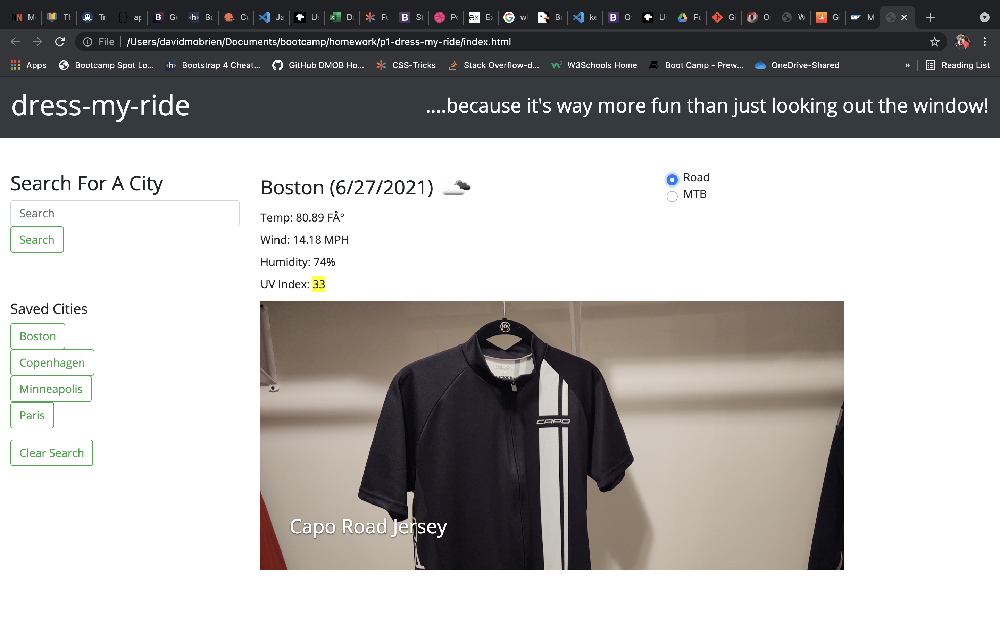

# p1-dress-my-ride

## Table of Contents
1. [General Info](#general-info)
2. [Screenshot](#screenshot)
3. [Technologies](#technologies)
4. [Installation](#installation)
5. [FAQs](#faqs)
### General Info
***
### dress-my-ride, because apparently I can't just walk outside and look at the weather!

Web based application showing the user at a glance the proper attire to be 
worn for that days' ride. Also makes recommendations for trip packing based
on 5 day forecast at any destination.

### Screenshot

## Technologies
***
A list of technologies used within the project:
  * HTML
  * Bootstrap
  * Javascript
  * jQuery
  * MomentJS

## Installation
***

Link to github repository- https://github.com/dmobrienllc/p1-dress-my-ride

Link to live site- https://dmobrienllc.github.io/p1-dress-my-ride/

## FAQs
***

Q Is this application awesome?

A Why yes it is!
---

# Unit 07: Project 1

## Overview

Welcome to Project 1! This is an important step in your full-stack journey as you will now use your newly acquired skills and knowledge to build web application from scratch. With your team, you will conceive and execute a design that solves a real-world problem by integrating data received from multiple server-side API requests. 

Because you will be working collaboratively, you will learn agile development methodologies and implement feature and bug fixes using git branch workflow and pull requests.

## Key Topics

The following topics will be covered in this unit:

* [Server-side APIs](https://en.wikipedia.org/wiki/Web_API)

* [Git branching workflow](https://git-scm.com/book/en/v2/Git-Branching-Branching-Workflows)

* [Agile software development](https://en.wikipedia.org/wiki/Agile_software_development)

## Learning Objectives

You will be employer-ready if you are able to:

* Speak technically about a feature you implemented in your project

* Explain and execute git branching workflow in a collaborative project

* Resolve merge conflicts

* Explain agile software development

* Design, build, and deploy a client-side web application using GitHub Pages

* Prepare a professional presentation and repository README for your project

## Homework

With your team, you'll conceive and execute a design that solves a real-world problem by integrating data received from multiple server-side API requests. You will also learn about agile development methodologies to help you work collaboratively. You will implement feature and bug fixes using git branch workflow and pull requests. 

You will write your own user stories and acceptance criteria in GitHub Issues to help your team stay on track with the project. Using GitHub Project as a means to track the status of your project tasks will help you understand the benefits of Kanban boards. 

## Career Connection

For more information about Career Services, including coding milestones, demo days, technical toolkits, workshops, and additional resources, visit the [Career Services website](https://mycareerspot.org/).

## Heads-Up

In the next unit, you'll continue to work on your group projects. You'll end the week by presenting your project to your class. Once your project is complete, you'll want to update your professional materials and add your new project to your portfolio.

## Resources

Here are some additional resources to help solidify the topics covered in this unit.

### Full-Stack Blog Posts

Check out the [Full-Stack Blog](https://coding-boot-camp.github.io/full-stack/) for additional resources, like walkthroughs, articles, and installation guides.

  * 📖 [API Resources](https://coding-boot-camp.github.io/full-stack/apis/api-resources)

### General

Refer to these resources for additional information about topics covered in this unit.

  * 📖 [Learn Enough Git to Be Dangerous](https://www.learnenough.com/git-tutorial/getting_started)

- - -
© 2021 Trilogy Education Services, LLC, a 2U, Inc. brand. Confidential and Proprietary. All Rights Reserved.
